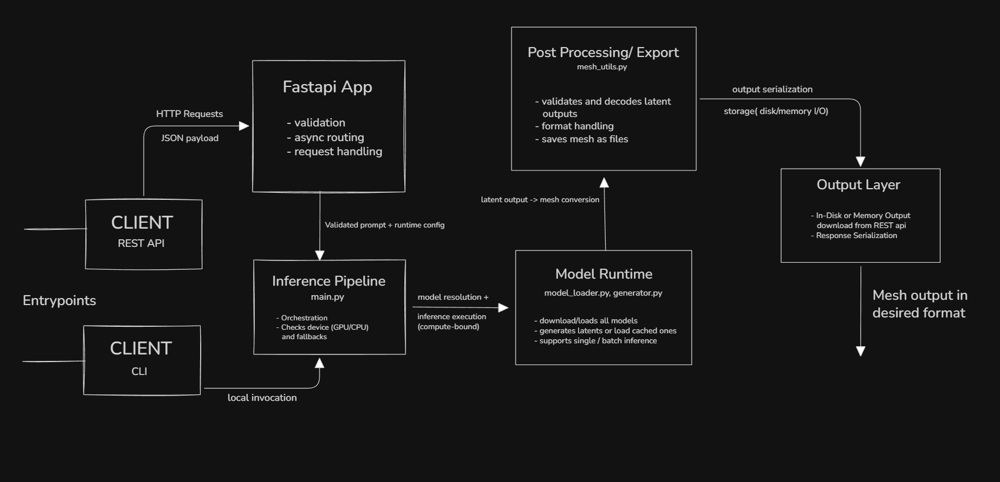

# Tesseract v1 – System Design 

## 1. Problem Statement

Tesseract addresses the problem of serving text-to-3D mesh generation as a reusable, programmable system rather than a one-off research demo.

Diffusion-based 3D generation is computationally expensive, exhibits high and variable inference latency, and is strongly dependent on both runtime configuration (e.g., batch size, sampling steps) and available hardware. Naively exposing such models through synchronous or tightly coupled interfaces leads to poor resource utilization and unpredictable behavior under load.

Tesseract focuses on structuring this process as a stateless, asynchronous inference service that can execute consistently across heterogeneous environments while remaining scriptable and reproducible.

## 2. High-Level Architecture

At a high level, Tesseract is structured as a stateless inference service with multiple entrypoints that converge into a single execution pipeline.

The system exposes two primary entrypoints: a REST API and a command-line interface (CLI). REST requests enter through a FastAPI application, where input validation and asynchronous request handling occur before execution is delegated to the inference pipeline. The CLI follows the same execution path through direct local invocation of the pipeline.

The inference pipeline is responsible for orchestrating execution, resolving runtime configuration, selecting the appropriate execution device (GPU or CPU), and coordinating model loading and inference through the model runtime. Model execution produces latent representations, which are subsequently converted into mesh assets during post-processing. Final outputs are serialized and written to disk or returned to the client depending on the invocation mode.

## 3. Request Lifecycle

The following describes the standard “happy path” execution flow for a single Tesseract request:

1. A client submits a text prompt via the REST API or the CLI.
2. FastAPI validates the request and dispatches it asynchronously.
3. The inference pipeline resolves runtime configuration and establishes the execution context, including device selection (GPU or CPU).
4. The model runtime loads the required models onto the selected device or reuses already loaded instances.
5. Diffusion-based inference is executed to generate latent representations.
6. Latent outputs are decoded and converted into mesh representations.
7. Mesh outputs are formatted according to the requested file formats.
8. Generated assets are serialized and written to disk or returned to the client for download.

## 4. Design Decisions
### Async FastAPI

FastAPI is used in asynchronous mode to ensure that request handling remains non-blocking despite long-running, GPU-bound inference operations. This allows multiple requests to be accepted and managed concurrently without preventing new requests from entering the system.

Asynchronous request handling improves responsiveness under load, but it does not reduce inference latency itself. The GPU remains the primary bottleneck during model execution.

---

### Stateless Architecture

Tesseract is designed as a stateless service, with no persistent in-memory state carried across requests. Each request is handled independently, and system behavior depends only on the provided input and configuration.

This simplifies scaling and deployment by avoiding tight coupling to individual machines or server instances. The primary trade-off is the absence of cross-request caching, which can lead to repeated computation.

---

### Config-Driven Execution

All runtime behavior in Tesseract is driven by explicit configuration rather than hardcoded defaults. Configuration parameters control sampling behavior, batch size, device selection, and output formats.

This approach enables reproducible inference, environment-specific tuning, and flexible execution across different hardware setups, at the cost of increased configuration surface area.

---

### GPU / CPU Fallback
The system supports automatic GPU usage when availaible, and a swift CPU fallback path to allow execution in heterogeneous environments.
This graceful degradation to CPU allows for inference even on low compute machines and servers at the cost of latency while still keeping correctness of inference preserved as the core Model runtime stays the same

The system automatically utilizes GPU acceleration when available and falls back to CPU execution otherwise. This allows Tesseract to run in heterogeneous environments without hard hardware requirements.

CPU fallback preserves correctness of inference but introduces significantly higher latency compared to GPU execution. This trade-off is accepted to prioritize portability and graceful degradation.

## 5. Trade-offs

- *Latency vs Simplicity :* Inference prioritizes correctness and clarity over agrresive optimization for low latency.
- *Statelessness vs Caching :* The system avoids cross-request state to simplify scaling at the cost of repeated computation.
- *Generality vs Specialization :* The pipeline is model-agnostic rather than heavily optimized for a single architecture. 

## 6. Current Limitations

- Cold-start latency due to model loading.
- Inference times unsuitable for real-time or interactive usage.
- Single-node execution without distributed inference.
- Output quality limited by the underlying model.

