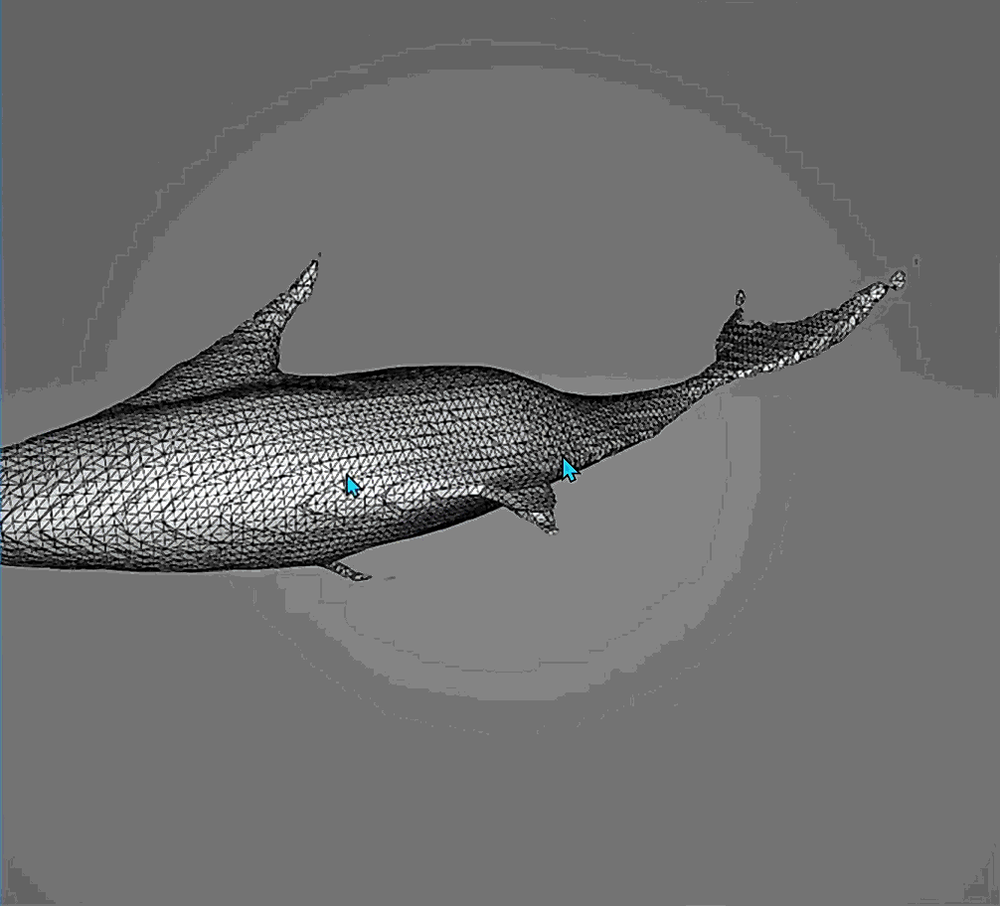

# Tesseract — v1.0

Tesseract is an asynchronous, stateless text-to-3D mesh generation system exposed through both a REST API and a command-line interface, all with flexible output formats..  
It is designed to make diffusion-based 3D generation **scriptable, reproducible, and deployment-aware**, rather than purely interactive or demo-driven.

The system wraps a text-conditioned 3D generation pipeline and provides a clean execution layer for generating mesh assets that can serve as **early-stage 3D canvases** for downstream refinement.

_A mini research-to-production inference pipeline._

<p align="center">
  
</p>

<p align="center">
  <em>Example generated mesh for the prompt <strong>"A shark"</strong>.</em>
</p>

---

## Table of Contents

1. [Overview](#overview)
2. [System Characteristics](#system-characteristics)
3. [Features](#features)
4. [Output Quality Notes](#output-quality-notes)
5. [Installation](#installation)
6. [Project Structure](#project-structure)
7. [Usage](#usage)
8. [API Examples](#api-examples)
9. [Configuration](#configuration)
10. [License](#license)

---

## Overview

Tesseract exists to make text-to-3D generation **accessible as an engineering system**, not just a research demo.

Instead of focusing on interactive UI workflows, the project emphasizes:
- programmatic execution
- batch-oriented generation
- reproducible configuration
- deployment-aware inference behavior

While the generated meshes are not intended to be final production assets, they provide a useful structural starting point that can significantly reduce the effort required to begin manual modeling in traditional 3D tools.

---

## System Characteristics

At a high level, Tesseract is built around the following principles:

- **Stateless execution**  
  Each request is handled independently, allowing horizontal scaling and predictable behavior.

- **Asynchronous inference**  
  Long-running GPU-bound generation is decoupled from request handling to avoid blocking.

- **Transport-agnostic core pipeline**  
  Both REST and CLI entrypoints converge into the same inference pipeline.

- **Configuration-driven execution**  
  All runtime behavior is controlled through YAML configuration rather than hardcoded logic.

- **Device-aware execution**  
  Automatic GPU usage when available, with graceful CPU fallback.

These choices are documented in detail in `DESIGN.md`.

---

## Features

Tesseract v1 provides:

- Text-to-3D mesh generation using diffusion-based models
- REST API for service-style usage and integration
- CLI for local, scripted, and batch workflows
- Asynchronous job execution with status tracking
- Multiple output formats:
  - **PLY**
  - **OBJ**
  - **GLB**
- Structured logging for both API and inference pipeline
- Output isolation per job to avoid conflicts
- Stateless API design suitable for horizontal scaling
- Minimal external dependencies to reduce deployment friction

---

## Output Quality Notes

The underlying Shape-E model is trained on limited and noisy 3D data, and as a result:

- Generated meshes are **not final production assets**
- Geometry may require cleanup or refinement
- Some outputs may be incomplete or low-detail

Despite this, the generated meshes are often **useful structural starting points**, allowing creators to iterate from an existing form instead of beginning from a blank scene.

Batch generation is recommended to increase the likelihood of obtaining a usable starting mesh.

Further tweaking of configuration parameters can also improve the usefulness of outputs and will be explained in later sections.

You can inspect Shape-E training samples here:  
https://github.com/openai/shap-e/tree/main/samples

---

## Installation

Tesseract is intended to be run inside an isolated Python environment.

### Using Conda
```bash
conda create -n tesseract python=3.10 -y
conda activate tesseract
pip install -r requirements.txt
```

### Using Python venv
```bash
python -m venv tesseract_env
source tesseract_env/bin/activate   # Linux / macOS
tesseract_env\Scripts\activate      # Windows
pip install -r requirements.txt
```

Python 3.10 is recommended for compatibility with all dependencies.

---

## Project Structure
```bash
tesseract/
├── api/                    # FastAPI interface
│   ├── api.py
│   └── schemas.py
├── tesseract/
│   ├── core/               # Core inference pipeline
│   │   ├── generator.py
│   │   ├── model_loader.py
│   │   └── mesh_util.py
│   ├── config/             # YAML configuration
│   ├── loggers/            # Logging utilities
│   ├── outputs/            # CLI-generated outputs
│   └── api_outputs/        # API-generated outputs
├── app.py                  # API entrypoint
├── cli.py                  # CLI entrypoint
├── main.py                 # Pipeline orchestration
├── requirements.txt
├── DESIGN.md               # System design documentation
└── LICENSE
```

---

## Usage

### Running the API
```bash
uvicorn app:app --reload --host 0.0.0.0 --port 8000
```

Available endpoints:

- Swagger UI: http://127.0.0.1:8000/docs
- ReDoc: http://127.0.0.1:8000/redoc
- Health check: http://127.0.0.1:8000/

### Running via CLI
```bash
# Basic generation
python cli.py -p "A simple chair"

# Higher quality sampling
python cli.py -p "A simple chair" -gs 30 --karras-steps 64 -bs 4

# Batch generation
python cli.py -b prompts.txt -f ply glb

# Full generation with custom parameters
python cli.py -p "A simple chair" -n my_chair -o tesseract/outputs -f ply glb -bs 2 -gs 20 --karras-steps 64 --use-fp16 --use-karras

# Batch processing from file
python cli.py -b prompts.txt -o output_folder -f obj glb --karras-steps 25

# Single prompt with dry run (testing configuration)
python cli.py -p "A simple chair" --dry-run
```


### Key CLI Parameters

| Flag | Description |
|------|-------------|
| `-p, --prompt` | Single text prompt to generate a 3D mesh |
| `-b, --batch_file` | Path to text file with one prompt per line |
| `-f, --formats` | Output formats: `ply`, `obj`, `glb` (default: ply) |
| `-n, --base_file` | Base filename for output files (default: generated_mesh) |
| `-bs, --batch-size` | Number of shapes(outputs) per prompt (default: 1) |
| `-gs, --guidance-scale` | Prompt adherence strength (default: 12.0) |
| `--karras-steps` | Denoising steps for quality (default: 30) |
| `--use-fp16` | Enable half-precision for memory efficiency (Default : On) |
| `-r, --resume-latents` | Resume from cached latents if available |
| `--dry-run` | Test configuration without generating files |


Use `--help` to inspect all available options.

---

## API Examples
```bash
# Submit generation job
curl -X POST http://127.0.0.1:8000/api/v1/generate \
  -H "Content-Type: application/json" \
  -d '{
    "prompt": "A stylized wooden bench",
    "formats": ["ply"]
  }'
```
```bash
# Check job status
curl http://127.0.0.1:8000/api/v1/status/<job_id>

# Download generated meshes as ZIP
curl -O -J "http://127.0.0.1:8000/api/v1/download/<job_id>"
```

### API Documentation

- **Interactive Docs**: [Swagger UI](http://127.0.0.1:8000/docs)
- **Static Docs**: [ReDoc](http://127.0.0.1:8000/redoc)

---

## Configuration

Runtime behavior is controlled via `defaults.yaml`.

Key parameter groups include:

- device selection (CUDA / CPU fallback)
- sampling steps and guidance strength
- batch size
- output formats and directories

Performance tuning guidelines are included in the configuration file comments.

---

### Configuration Parameters Explained

#### General Settings
- **`project_name`**: Project identifier for logs and metadata
- **`model`**: Underlying model family (`shap-e`)
- **`base_model`**: Text-conditioned model variant (`text300M`)
- **`transmitter`**: Renderer model identifier
<!-- - **`seed`**: Random seed for reproducible results -->

#### Device Settings
- **`use_cuda`**: Enable CUDA acceleration when available
- **`fallback_to_cpu`**: Allow CPU fallback if CUDA unavailable

#### Latent Generation Parameters
- **`batch_size`**: Range `[1-8+]` - Higher values increase memory usage
- **`guidance_scale`**: Range `[1.0-20.0+]` - Controls prompt fidelity vs creativity
- **`karras_steps`**: Range `[15-128+]` - More steps = higher quality, slower generation
- **`sigma_min/max`**: Noise level bounds affecting detail vs noise tradeoff
- **`s_churn`**: Range `[0.0-10.0]` - Adds randomness/diversity to sampling

#### File Management
- **`output_dir`**: Directory for generated meshes and assets
- **`base_file`**: Default filename template
- **`default_format`**: Supported formats: `ply`, `obj`, `glb`

#### Rendering Options (Experimental)
- **`render_mode`**: Preview rendering engine (`nerf`)
- **`size`**: Preview resolution for images/GIFs
- **`render`**: Enable/disable automatic preview generation

### Performance Tuning Tips

**For Limited GPU Memory:**
- Set `batch_size: 1`
- Start with `karras_steps: 20-25`
- Enable `use_fp16: true`

**For Quality vs Speed:**
- **Higher Quality**: Increase `karras_steps` (50-100), `guidance_scale` (20+)
- **Faster Generation [NOT RECOMMENDED]**: Decrease `karras_steps` (10-15), `guidance_scale` (8-12)

**For Creative vs Faithful Output:**
- **More Creative**: Lower `guidance_scale` (5-10)
- **More Faithful**: Higher `guidance_scale` (15-25)

---

## License

This project is licensed under the **GNU Affero General Public License v3.0 (AGPL-3.0)**.

This means:

- You may use, modify, and distribute the software
- Clone it for research, testing, or improvement  
- Run it locally or in production environments 

You must:

- Keep the license intact in all copies or substantial portions of the software  
- Release source code for any modifications you make if you distribute or run it as a network service  
- Comply with the licensing terms of any third-party dependencies used in this project  

You cannot:

- Make proprietary or closed-source derivatives without also releasing the modified source code  
- Remove copyright or license notices

Tesseract uses Shape-E, an OpenAI project released under the MIT License.  
All usage must comply with OpenAI's licensing terms.

See `LICENSE` for full details.